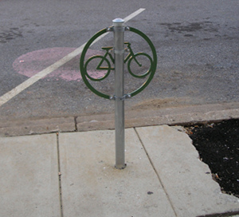
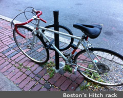
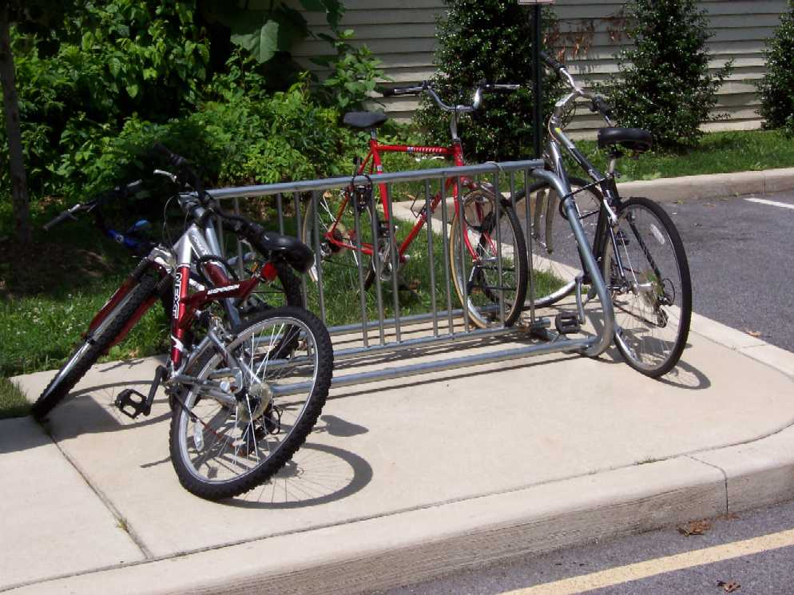
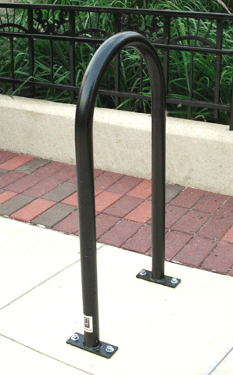
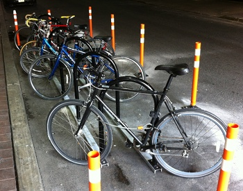
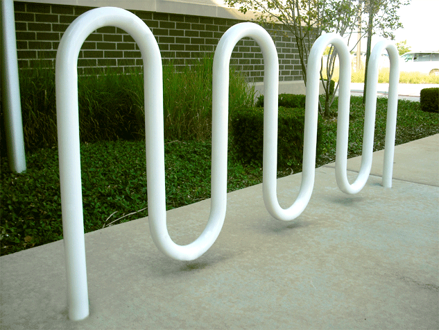

## Ongoing Survey of Bike Rack Locations

**Description**

Bike rack locations in the City of Philadelphia, compiled by the [Mayor's Office of Transportation and Utilities](http://www.phila.gov/motu/index.html).

This dataset includes: 

1. Surveyed bicycle rack locations in Center City, and; 
2. Streets surveyed for bicycle parking.  

Bicycle rack locations are part of an ongoing effort by the Mayor's Office of Transportation and Utilities to survey bicycle parking in Philadelphia and is not a complete set.  As such, information on streets surveyed in Center City as part of this effort is also included.  All bicycle rack locations are approximate.

**Fields**

* RACK_TYPE - the type of bicycle rack.
* BIKE_COUNT - the number number of bikes that a specific rack can accommodate.
* LAT - Latitude of the rack location. 
* LNG - Longitude of the rack location.

**Rack Types**

* Converted Parking Meter

 
* Hitch Style

* Other
* School Yard

* Staple or Inverted-U

* Street Corral

* Wave

**License**

Please see [terms of use & disclaimer](https://github.com/CityOfPhiladelphia/terms-of-use/blob/master/LICENSE.md).
